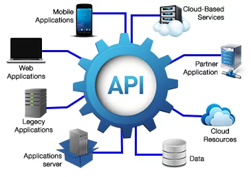

# Introdução

**Chamadas e Retornos**

Todas as chamadas são feitas por meio do protocolo HTTPS e asseguradas através da passagem de cabeçalhos de segurança.

Os retornos da API obedecem rigorosamente os padrões da WEB, retornando códigos de [status ](https://pt.wikipedia.org/wiki/Lista\_de\_c%C3%B3digos\_de\_estado\_HTTP)conforme o tipo da requisição.

**URL Base**: [https://api.solucx.com.br/public](https://api.solucx.com.br/public)

Todas as chamadas devem ser feitas por meio da [URL ](https://woliveiras.com.br/posts/url-uri-qual-diferenca/)Base juntamente com o endereço do recurso a ser consumido, ou mais exatamente, a [URI](https://woliveiras.com.br/posts/url-uri-qual-diferenca/).


[seguranca-da-api.md](seguranca-da-api.md)



[orientacoes-gerais-de-uso.md](orientacoes-gerais-de-uso.md)


**Glossário**


[terminologias-comuns.md](terminologias-comuns.md)


#### **Métodos permitidos**

| Métodos    | Descrição                                                              |
| ---------- | ---------------------------------------------------------------------- |
| **POST**   | Criar novo objeto na plataforma.                                       |
| **GET**    | Obter um objeto ou lista de objetos da plataforma.                     |
| **PUT**    | Alterar um objeto presente na plataforma por meio de um Identificador. |
| **DELETE** | Remove um objeto da plataforma por meio de um identificador.           |

Para maior simplicidade, todas as chamadas são realizadas pela URL [https://api.solucx.com.br/public](https://api.solucx.com.br/public)
