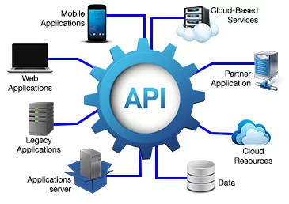

# Introduction

**Requests and Responses**

All requests are made via the HTTPS protocol and secured through the use of security headers.

API responses strictly follow web standards, returning status codes according to the type of request.

**URL Base**: [https://api.solucx.com.br/public](https://api.solucx.com.br/public)

All requests must be made using the Base URL along with the resource endpoint to be accessed, or more precisely, the URI.


[seguranca-da-api.md](seguranca-da-api.md)



[orientacoes-gerais-de-uso.md](orientacoes-gerais-de-uso.md)


**Glossário**


[terminologias-comuns.md](terminologias-comuns.md)


#### **Métodos permitidos**

| Métodos    | Descrição                                                              |
| ---------- | ---------------------------------------------------------------------- |
| **POST**   | Criar novo objeto na plataforma.                                       |
| **GET**    | Obter um objeto ou lista de objetos da plataforma.                     |
| **PUT**    | Alterar um objeto presente na plataforma por meio de um Identificador. |
| **DELETE** | Remove um objeto da plataforma por meio de um identificador.           |

Para maior simplicidade, todas as chamadas são realizadas pela URL [https://api.solucx.com.br/public](https://api.solucx.com.br/public)
